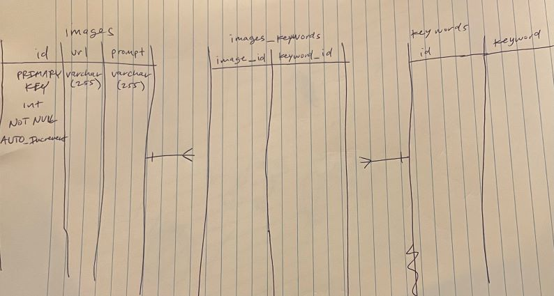

# projectX

## Backend

There are two major processes happening on the backend:

1. Querying for images. In order to load non-redundant data, a page number is expected. The mySQL database returns an array of URLs sorted by most recently added.
   One route accounts for a supplied keyword, the other does not. These URLs are endpoints that supply the image via the S3 bucket.

2. Uploading images. An image blob is sent to the backend, where it is uploaded to an S3 bucket. The bucket returns the endpoint (a URL) where the image is stored.
   This URL is added to the database, along with the keywords given at the time of image creation.

### Database

Effectively storing and retrieving image data merits two separate databases: one for easily storing/querying relational data and one for managing the image files.

#### AWS RDS mySQL

This database holds all relational data. The url attribute refers to the URL where the data is stored on the AWS server.

#### AWS S3 Bucket

This database holds the actual image files. Images are accessed using an Object URL.

### Future Development Ideas

1. Support multi-keyword queries.
2. Create a relational database with a date attribute and do the querying by that attribute. Currently we are querying by id (which does work based on how our id attribute, but
   it's likely not best practice.)
